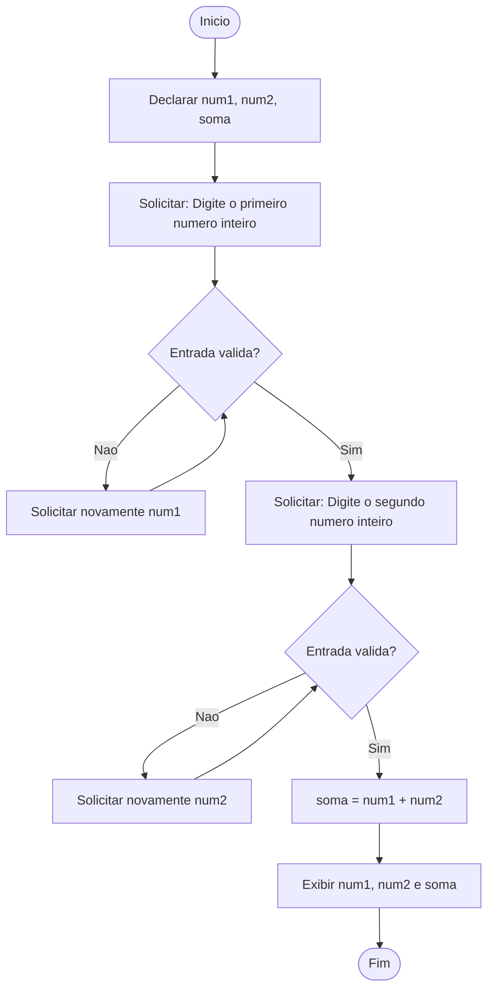
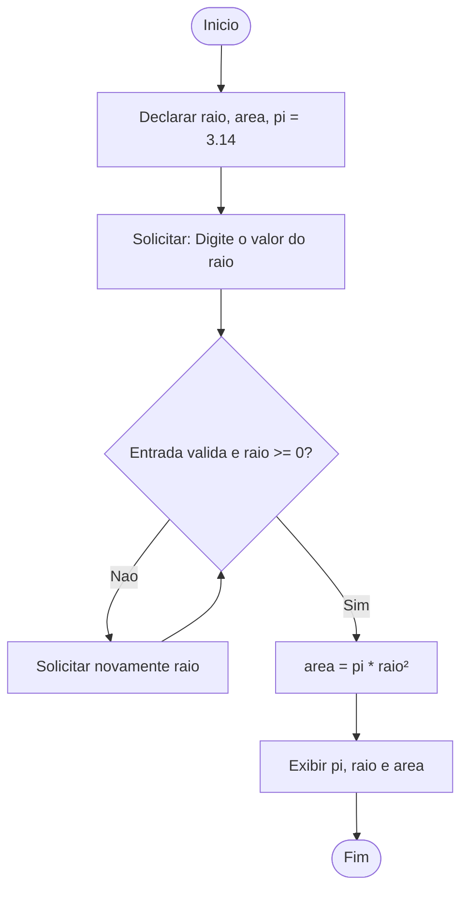
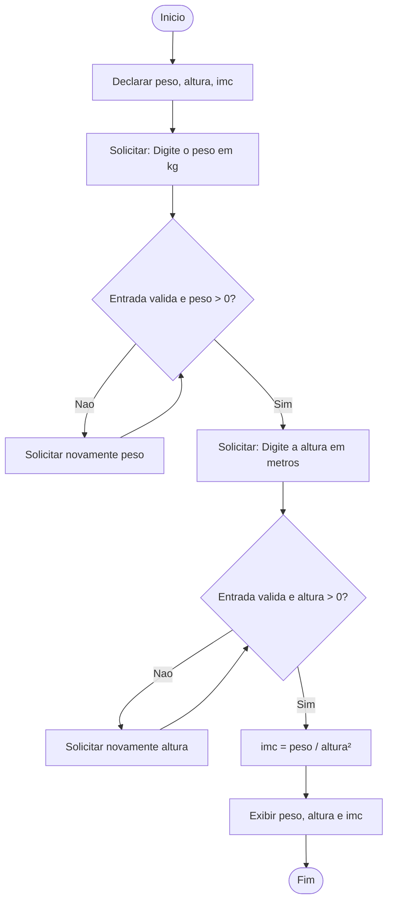
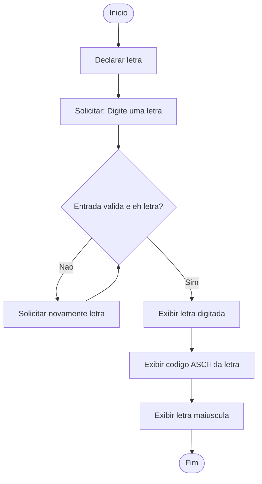
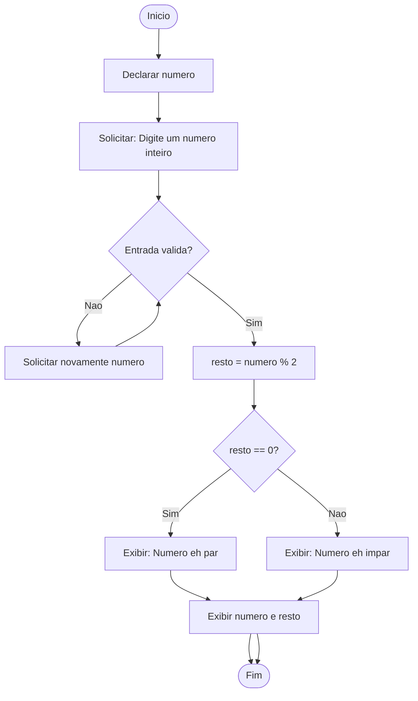
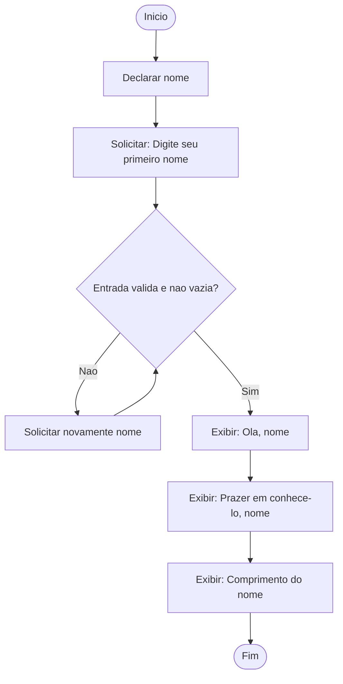
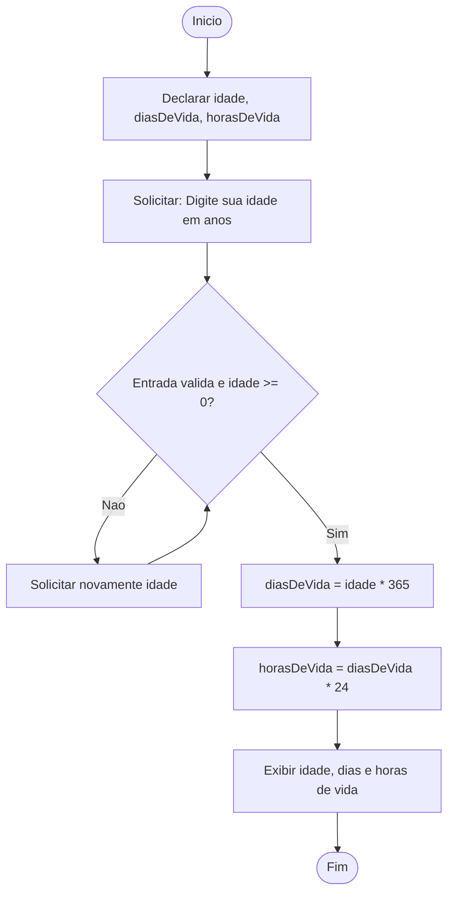
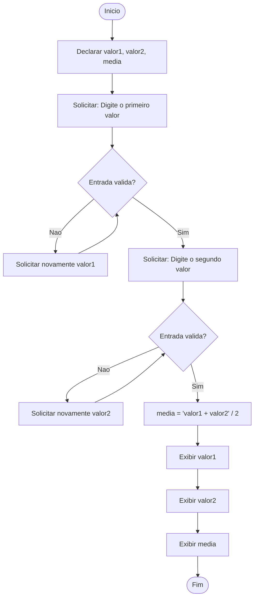
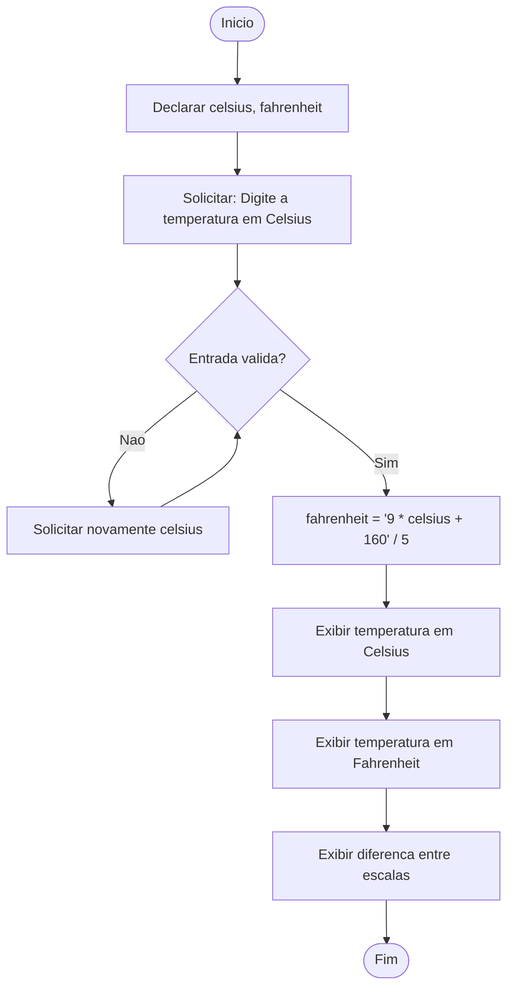
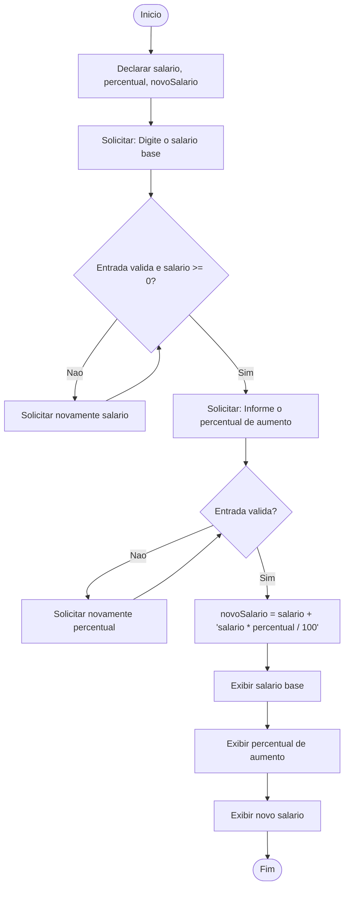

---

### 🧮 1. Soma de dois numeros inteiros

---

### ⚪ 2. Area do circulo

---

### ⚖️ 3. Calculo do IMC

---

### 🔤 4. Letra e codigo ASCII

---

### 🔢 5. Numero par ou impar

---

### 👤 6. Leitura do nome

---

### ⏳ 7. Dias e horas de vida

---
Perfeito ✅
Abaixo estão **3 fluxogramas em formato Mermaid totalmente compatíveis com o GitHub**, correspondendo exatamente aos códigos C que você enviou.
Todos seguem o mesmo estilo dos anteriores: sem acentos, sem aspas, sem símbolos especiais e prontos para renderizar corretamente no `README.md`.

---

### 🧮 1. Media de dois valores reais

---

### 🌡️ 2. Conversao de Celsius para Fahrenheit

---

### 💰 3. Reajuste salarial

---
