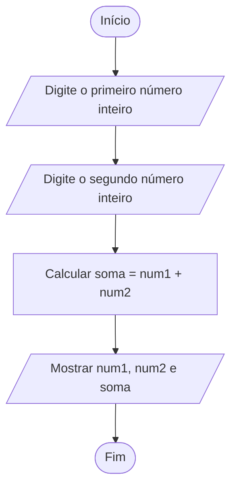
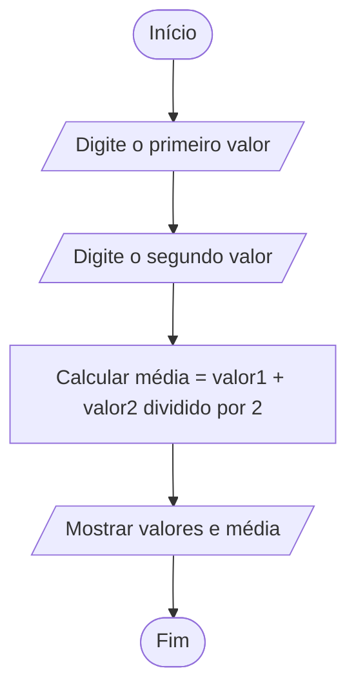
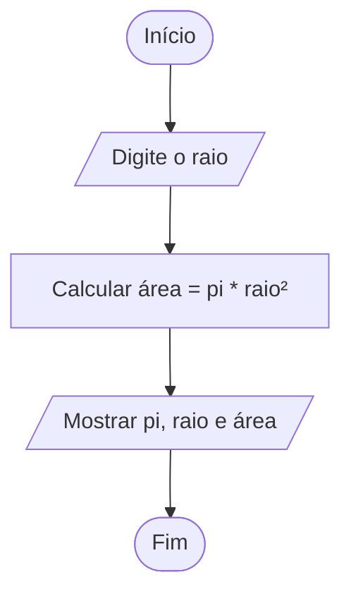
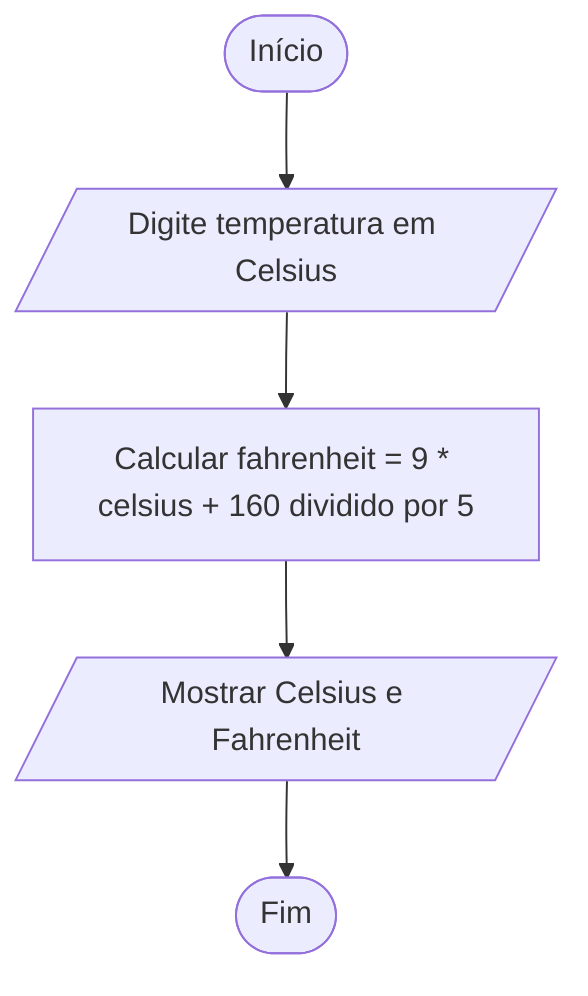
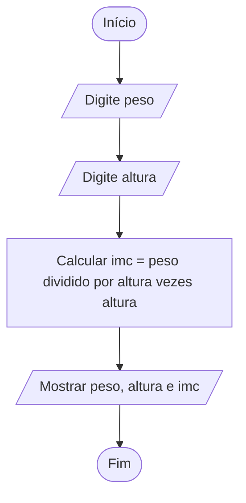
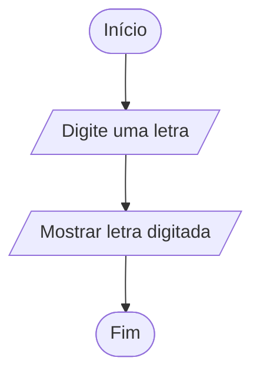
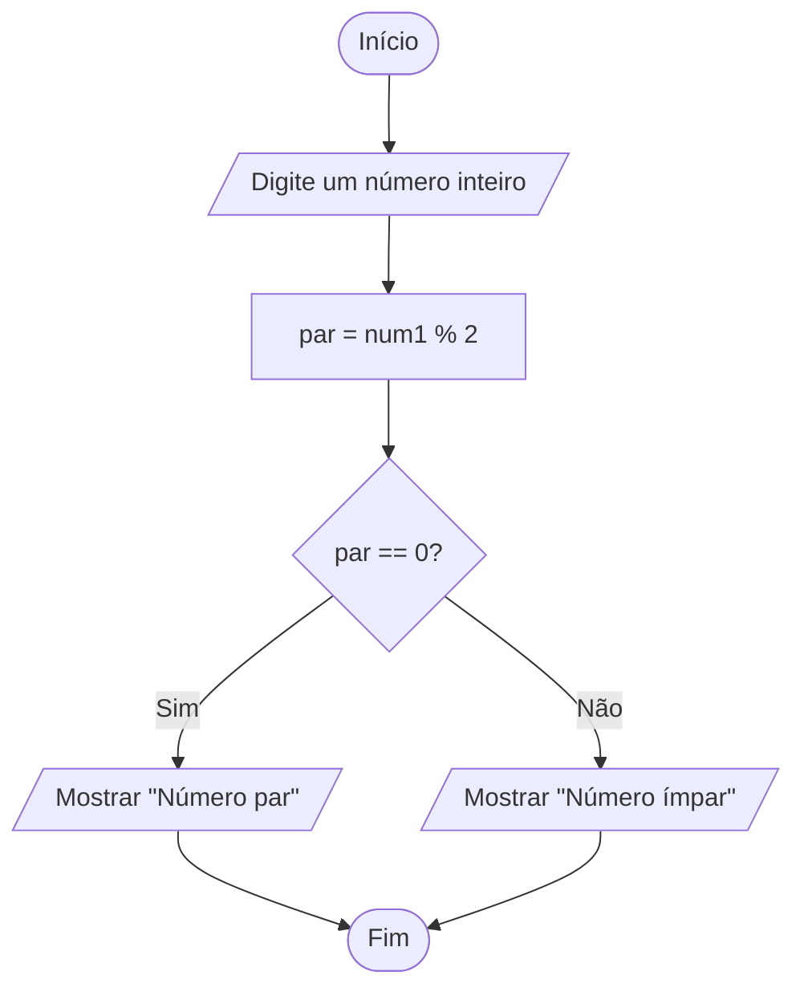
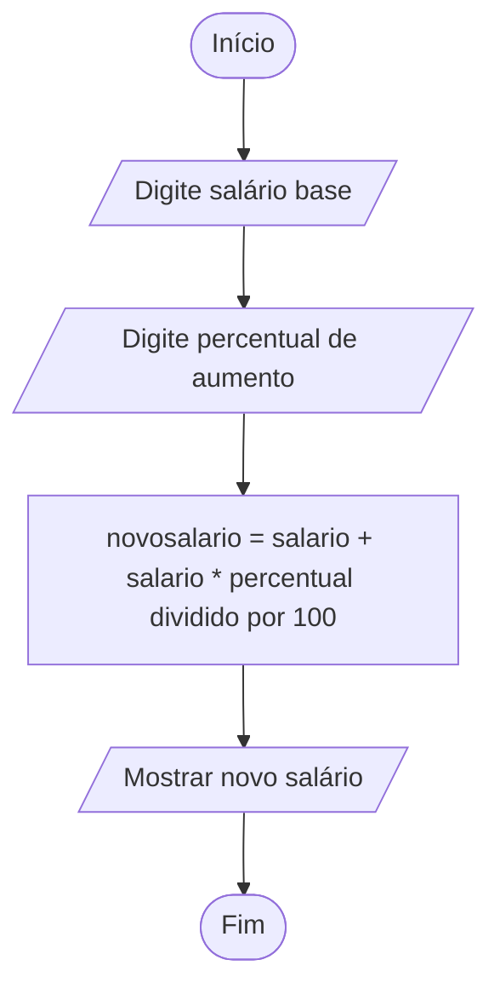
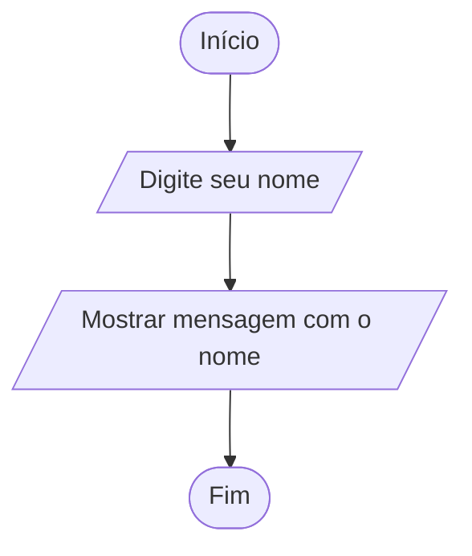
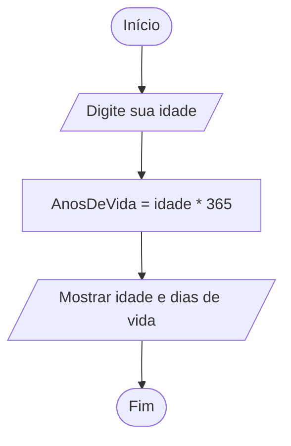

# 🎨 Fluxogramas dos Programas em C

### 🔶 Legenda de Formas

* **Oval** → Início / Fim
* **Paralelogramo** → Entrada / Saída de dados
* **Retângulo** → Processamento (cálculos ou atribuições)
* **Losango** → Decisão (condicionais `if`)

---

## 🧮 1. Soma de dois números inteiros

---

## 📊 2. Média de dois valores

---

## ⚪ 3. Área do círculo

---

## 🌡️ 4. Conversão Celsius → Fahrenheit

---

## ⚖️ 5. Cálculo de IMC

---

## 🔠 6. Leitura de uma letra

---

## 🔢 7. Verificação de número par ou ímpar

---

## 💰 8. Novo salário com aumento

---

## 😀 9. Leitura e exibição do nome

---

## ⏳ 10. Cálculo de dias de vida

